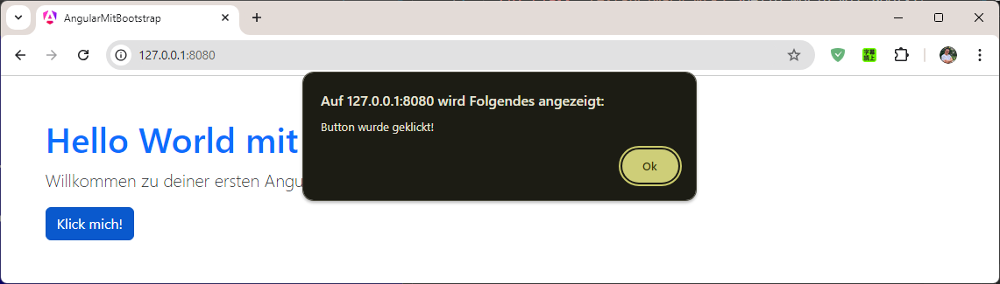

# AngularMitBootstrap – Hello World mit Bootstrap

Diese Anleitung beschreibt, wie ein Angular-Projekt mit Bootstrap-Unterstützung erstellt wird.



## Voraussetzungen

- Angular CLI muss installiert sein (`npm install -g @angular/cli`).


# Anleitung


### Ein neues Angular-Projekt erstellen

Ein neues Angular-Projekt wird mit der Angular CLI erstellt:

```` terminal
ng new AngularMitBootstrap
````

Sass (SCSS) auswählen:

```` terminal
? Which stylesheet format would you like to use?
  CSS             [ https://developer.mozilla.org/docs/Web/CSS                     ]
❯ Sass (SCSS)     [ https://sass-lang.com/documentation/syntax#scss                ]
  Sass (Indented) [ https://sass-lang.com/documentation/syntax#the-indented-syntax ]
  Less            [ http://lesscss.org                                             ]
````

SSR und SSG NICHT aktivieren:

```` terminal
? Which stylesheet format would you like to use? Sass (SCSS) 
[ https://sass-lang.com/documentation/syntax#scss          ]
? Do you want to enable Server-Side Rendering (SSR) and Static Site Generation (SSG/Prerendering)? (y/N) N
````

In das Projektverzeichnis wechseln:

```` terminal
cd AngularMitBootstrap
````

### Bootstrap hinzufügen

Bootstrap wird dem Projekt über npm hinzugefügt:

```` terminal
npm install bootstrap
````

Bootstrap in das Projekt einbinden. Dazu die Datei `angular.json` öffnen und unter `styles` folgendes hinzufügen:

```` json
"node_modules/bootstrap/dist/css/bootstrap.min.css"
````

```` json
...
            "styles": [
              "src/styles.scss",
              "node_modules/bootstrap/dist/css/bootstrap.min.css"
            ],
...
````

### Visual Studio Code öffnen

Das Projekt wird in Visual Studio Code zur Bearbeitung geöffnet:

```` terminal
code .
````

----

## Projekt Bearbeiten

Folgende Schritte beschreiben das Bearbeiten eines bereits erstellten Angular-Projekts.


### Bearbeite die App-Komponente

Den Inhalt der `app.component.html` ändern, um eine einfache Hello World-Nachricht anzuzeigen. Bootstrap-Komponenten werden dabei verwendet.

Öffne `src/app/app.component.html` und ersetze den gesamten Inhalt durch diesen Code:

```` html
<div class="container">
  <h1 class="text-primary mt-5">Hello World mit Bootstrap!</h1>
  <p class="lead">Willkommen zu deiner ersten Angular-App mit Bootstrap-Unterstützung.</p>
  <button class="btn btn-primary" (click)="onButtonClick()">Klick mich!</button>
</div>
````

### Funktionalität hinzufügen

Um dem Button eine Funktion zu geben, öffne die Datei `app.component.ts` und füge folgende Methode hinzu:

```` typescript
import { Component } from '@angular/core';

@Component({
  selector: 'app-root',
  templateUrl: './app.component.html',
  styleUrls: ['./app.component.css']
})
export class AppComponent {
  title = 'AngularMitBootstrap';

  // EINTRAGEN
  onButtonClick() {
    alert('Button wurde geklickt!');
  }

}
````

<!-- 

### Bearbeite die App-Komponente

Den Inhalt der `app.component.html` ändern, um eine einfache Hello World-Nachricht anzuzeigen. Bootstrap-Komponenten werden dabei verwendet.

Öffne `src/app/app.component.html` und ersetze den gesamten Inhalt durch diesen Code:

```` html
<div class="container">
  <h1 class="text-primary mt-5">Hello World mit Bootstrap!</h1>
  <p class="lead">Willkommen zu deiner ersten Angular-App mit Bootstrap-Unterstützung.</p>
  <button class="btn btn-primary">Klick mich!</button>
</div>
````

-->


## 9. npm start | Ausführen der Anwendung

So wird nun der Angular-Entwicklungsserver (`ng serve`) verwendet, um die Anwendung zu starten.

```` terminal
npm start
````

oder

```` terminal
ng serve --open
````

http://localhost:4200/


So kann das gesamte Projekt mit nur einem Befehl (`npm start`) gebaut und auf einem Server bereitgestellt werden!


---

### Die App für die Produktion bauen

Das Projekt wird für die Produktion gebaut:

```` terminal
ng build --configuration production
````

Falls Fehler bei der Ausführung auftreten oder **_das Script geändert wird_** , muss dieser Befehl erneut ausgeführt werden:

```` terminal
ng build --configuration production
````

So wird der `dist`-Ordner erstellt, welcher alle notwendigen Dateien für die produktive Bereitstellung enthält.

Bei Warnungen:

```` terminal
ng analytics disable
````

---


####  Warum erforderlich?

Die Schritte für den Produktionsbuild sind notwendig, weil Angular standardmäßig in der Entwicklungsumgebung läuft, wenn man `ng serve` ausführt. In dieser Umgebung werden zusätzliche Überprüfungen und Debug-Informationen eingebaut, um die Entwicklung zu erleichtern. Diese Schritte optimieren den Code und bereiten ihn für eine produktive Umgebung vor:

 1. Produktionserstellung (ng build --configuration production):

 - **Optimierung des Codes:** Der Build-Befehl erstellt eine optimierte Version des Projekts. Dazu gehören Minifizierung von JavaScript, Entfernen von nicht benötigtem Code und Reduzierung der Dateigrößen.
 - **Ausschalten von Debug-Informationen:** Der Produktionsbuild entfernt Debug-Informationen, um die Ausführungsgeschwindigkeit und die Sicherheit zu verbessern.
 - **Performance-Verbesserungen:** Ein Produktionsbuild aktiviert zusätzliche Performance-Optimierungen, wie das AOT-Compiling (Ahead-of-Time), Tree Shaking und Code Splitting.

 2. Neuer Build bei Änderungen:

 - Wenn Fehler auftreten oder Änderungen am Skript (Code) vorgenommen werden, muss der Produktionsbuild erneut ausgeführt werden, um die Änderungen in die finalen Dateien zu integrieren. Andernfalls würde die alte Version aus dem letzten Build verwendet werden.

 3. Dist-Ordner:

 - Der `ng build`-Befehl erstellt einen `dist`-Ordner (Distributions-Ordner), der alle optimierten Dateien enthält. Dieser Ordner kann dann auf einen Webserver hochgeladen werden, um die Anwendung in einer produktiven Umgebung bereitzustellen.
 
 4. Deaktivierung von Angular Analytics (`ng analytics disable`):

 - Bei der Erstellung des Builds könnten Warnungen bezüglich der Analysefunktionen von Angular auftreten. Mit dem Befehl `ng analytics disable` wird die Datenerfassung von Angular deaktiviert, was speziell für produktive Umgebungen empfohlen wird.

Zusammengefasst sind diese Schritte entscheidend, um eine leistungsstarke, sichere und optimierte Version der Anwendung für die produktive Bereitstellung zu erstellen.


## Teste die App lokal mit http-server

Um die App lokal zu testen, kann ein einfacher HTTP-Server verwendet werden. Zuerst `http-server` global installieren:

```` terminal
npm install -g http-server
````

Dann den Server im Projekt-Ordner starten:

```` terminal
http-server dist/angular-mit-bootstrap/browser -p 8080
````

Einen Browser öffnen und zu folgenden Adresse navigieren:

http://localhost:8080/

http://127.0.0.1:8080/

Die Seite sollte nun die Bootstrap-gestylte Hello World-Nachricht anzeigen.


---

####  Warum erforderlich?

Diese Schritte sind erforderlich, um die Anwendung in einer produktionsnahen Umgebung zu testen und sicherzustellen, dass die Anwendung wie erwartet funktioniert, bevor sie auf einen tatsächlichen Server bereitgestellt wird. Hier ist die Begründung für jeden Schritt:

 1. Installation von http-server:

 - `http-server` ist ein einfacher, leichtgewichtiger HTTP-Server, der Node.js verwendet. Er wird global installiert, um ihn von überall aus in deinem System ausführen zu können. Diese Installation ermöglicht es dir, einen einfachen lokalen Webserver zu starten, ohne komplexere Server wie Apache oder Nginx einrichten zu müssen.
  
  2 . Starten des Servers:

  - Der Befehl `http-server dist/angular-mit-bootstrap/browser -p 8080` startet den Server im `dist`-Verzeichnis, das durch den Produktions-Build (`ng build`) erzeugt wurde. Der Server hostet die Anwendung auf Port 8080. Das ist wichtig, da Angular-Builds statische Dateien erzeugen, die in einem produktiven Kontext nur über einen Webserver aufgerufen werden können (und nicht einfach durch Öffnen der HTML-Datei im Browser).
 
 3. Zugriff auf den Server:

 - Durch die Adressen `http://localhost:8080/` oder `http://127.0.0.1:8080/` wird der lokal laufende Server im Browser geöffnet, um die Anwendung zu testen. Dadurch kannst du überprüfen, ob die Anwendung ordnungsgemäß geladen wird, Bootstrap korrekt eingebunden ist und die grundlegende Funktionalität funktioniert, wie z. B. das Klicken auf den Button.
  
**Warum dieser Test wichtig ist:**

- **Testen in einer produktionsähnlichen Umgebung:** Wenn du die App einfach nur über `ng serve` im Entwicklungsmodus testest, hast du nicht die gleichen Optimierungen wie im Produktionsmodus. Der `http-server` simuliert das Hosten der optimierten, produktionsfertigen Version, die sich ähnlich verhält wie auf einem echten Webserver.
- **Fehler und Inkompatibilitäten entdecken:** Es gibt manchmal Unterschiede in der Art und Weise, wie der Code im Entwicklungs- und Produktionsmodus ausgeführt wird. Durch die lokale Verwendung eines Servers kannst du sicherstellen, dass alles funktioniert, bevor die App auf einen echten Webserver hochgeladen wird.

Zusammengefasst helfen diese Schritte sicherzustellen, dass die Anwendung auch in einer produktionsnahen Umgebung fehlerfrei funktioniert und die erwarteten Ergebnisse liefert.

---


## Markdown-Datei (.md)

