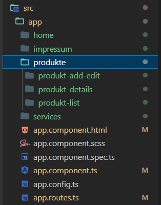
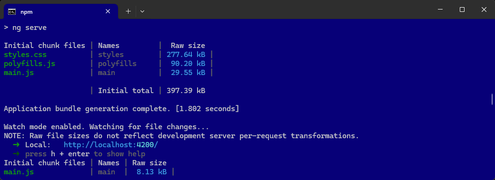

# AngularMitRouting

In dieser Anleitung wird beschrieben, wie ein Angular-Projekt mit Bootstrap und Routing-Unterstützung erstellt wird. 


## Voraussetzungen
- Angular CLI muss installiert sein (`npm install -g @angular/cli`).


# Anleitung

### 1. Ein neues Angular-Projekt erstellen

Erstelle ein neues Angular-Projekt, wie in der vorherigen Anleitung beschrieben:

```terminal
ng new AngularMitRouting
```

- Wähle `Sass (SCSS)` als Stylesheet-Format.
- Aktiviere SSR und SSG nicht, wenn gefragt (`n`).


Sass (SCSS) auswählen:

```` terminal
? Which stylesheet format would you like to use?
  CSS             [ https://developer.mozilla.org/docs/Web/CSS                     ]
❯ Sass (SCSS)     [ https://sass-lang.com/documentation/syntax#scss                ]
  Sass (Indented) [ https://sass-lang.com/documentation/syntax#the-indented-syntax ]
  Less            [ http://lesscss.org                                             ]
````

SSR und SSG NICHT aktivieren:

```` terminal
? Which stylesheet format would you like to use? Sass (SCSS) 
[ https://sass-lang.com/documentation/syntax#scss          ]
? Do you want to enable Server-Side Rendering (SSR) and Static Site Generation (SSG/Prerendering)? (y/N) N
````

Wechsle dann ins Projektverzeichnis:

```terminal
cd AngularMitRouting
```

### 2. Bootstrap hinzufügen
Füge Bootstrap dem Projekt hinzu:

```terminal
npm install bootstrap
```


Öffne das Projekt in Visual Studio Code:

```terminal
code .
```

Bearbeite die `angular.json`, um Bootstrap einzubinden:

```json
{
  ...
  "styles": [
    "src/styles.scss",
    "node_modules/bootstrap/dist/css/bootstrap.min.css"
  ],
  ...
}
```

----

### 4. User-Komponenten erstellen
Für die Seite erstellen wir folgende Komponenten:

```terminal
ng generate component home
ng generate component services
ng generate component impressum

ng generate component produkte/produkt-list
ng generate component produkte/produkt-add-edit
ng generate component produkte/produkt-details
```

oder

```terminal
ng g c home
ng g c services
ng g c impressum

ng g c produkte/produkt-list
ng g c produkte/produkt-add-edit
ng g c produkte/produkt-details
```

Die Komponenten dienen dazu, eine Liste der Produktr anzuzeigen, Produkte hinzuzufügen/zu bearbeiten sowie Details von Produkten einzusehen.



----

### 5. Services erstellen 
Erstelle einen Service, der die Daten verwaltet:

```terminal
ng generate service _services/user
```

Bearbeite die Datei `user.service.ts`, um die Daten für die Produktverwaltung zu verwenden:

...

----

### 6. Routes anpassen

Bearbeite die Datei `app.routes.ts` , um die Routen für die Benutzerverwaltung zu definieren:

```` typescript
import { Routes } from '@angular/router';

// EINTRAGEN
import { HomeComponent } from './home/home.component';
import { ImpressumComponent } from './impressum/impressum.component';
import { ServicesComponent } from './services/services.component';

import { ProduktListComponent } from './produkte/produkt-list/produkt-list.component';
import { ProduktAddEditComponent } from './produkte/produkt-add-edit/produkt-add-edit.component';
import { ProduktDetailsComponent } from './produkte/produkt-details/produkt-details.component';

//export const appRoutes: Routes = [
export const routes: Routes = [

  // EINTRAGEN
  { path: 'home', component: HomeComponent },
  { path: 'impressum', component: ImpressumComponent },
  { path: 'services', component: ServicesComponent },

  // EINTRAGEN
  { path: 'produkte', component: ProduktListComponent },
  { path: 'produkte/add', component: ProduktAddEditComponent },
  { path: 'produkte/edit/:id', component: ProduktAddEditComponent },
  { path: 'produkte/details/:id', component: ProduktDetailsComponent },

  // STARTSEITE
  { path: '', redirectTo: 'home', pathMatch: 'full' },
  { path: '**', redirectTo: 'home' }, // Wildcard-Route für alle nicht gefundenen Pfade
];
````


### 7. app.component aktualisieren

Bearbeite die Datei `app.component.html` :

```` html
<p>In Bearbeitung</p>

<router-outlet />
````

Im Url angegebene Component (wie `/services/`) wird im router-outlet ausgegeben.

Die URLs, die im Routes realisiert worden sind:

```` html
http://localhost:4200/home/
http://localhost:4200/impressum/
http://localhost:4200/services/

http://localhost:4200/produkte/
http://localhost:4200/produkte/add/
http://localhost:4200/produkte/edit/1
http://localhost:4200/produkte/details/1

http://localhost:4200/ ---> home
```` 
----

### 8. Navigation

Bearbeite die Datei `app.component.html` und füge eine einfache Navigation hinzu, um auf die Produktverwaltung zugreifen zu können:

```` html
<p>In Bearbeitung</p>

<nav>
    <ul>
        <li><a routerLink="/home" routerLinkActive="active">Home</a></li>
        <li><a routerLink="/services" routerLinkActive="active">Services</a></li>
        <li><a routerLink="/impressum" routerLinkActive="active">Impressum</a></li>

        <li><a routerLink="/produkte" routerLinkActive="active">Produkte</a></li>
        <li><a routerLink="/produkte/add/" routerLinkActive="active">Add</a></li>
        <li><a routerLink="/produkte/edit/1" routerLinkActive="active">Edit 1</a></li>
        <li><a routerLink="/produkte/details/1" routerLinkActive="active">Details 1</a></li>
    </ul>
</nav>

<router-outlet />
````

oder

```` html
<p>In Bearbeitung</p>

<nav class="navbar navbar-expand-lg navbar-dark bg-dark">
    <ul class="navbar-nav">
        <li class="nav-item">
            <a class="nav-link" routerLink="/home" routerLinkActive="active">Home</a>
        </li>
        <li class="nav-item">
            <a class="nav-link" routerLink="/services" routerLinkActive="active">Services</a>
        </li>
        <li class="nav-item">
            <a class="nav-link" routerLink="/impressum" routerLinkActive="active">Impressum</a>
        </li>


        <li class="nav-item">
            <a class="nav-link" routerLink="/produkte" routerLinkActive="active">Produkte</a>
        </li>
        <li class="nav-item">
            <a class="nav-link" routerLink="/produkte/add/" routerLinkActive="active">Add</a>
        </li>
        <li class="nav-item">
            <a class="nav-link" routerLink="/produkte/edit/1" routerLinkActive="active">Edit 1</a>
        </li>
        <li class="nav-item">
            <a class="nav-link" routerLink="/produkte/details/1" routerLinkActive="active">Details 1</a>
        </li>


    </ul>
</nav>

<router-outlet />
````

Bearbeite die Datei `app.component.ts` und füge die Imports hinzu:

```` html
import { Component } from '@angular/core';
import { RouterOutlet } from '@angular/router';

// EINTRAGEN für Router!
import { RouterLink, RouterLinkActive } from '@angular/router'; 

@Component({
  selector: 'app-root',
  standalone: true,
  imports: [
    RouterOutlet,

    RouterLink,        // <-- EINTRAGEN für Router!
    RouterLinkActive,  // <-- EINTRAGEN für Router!

  ],
  templateUrl: './app.component.html',
  styleUrl: './app.component.scss'
})
export class AppComponent {
  title = 'AngularMitRouting';
}
````

----


# Extras


## 1. npm start | Ausführen der Anwendung

So wird nun der Angular-Entwicklungsserver (`ng serve`) verwendet, um die Anwendung zu starten.

```` terminal
npm start
````

oder

```` terminal
ng serve --open
````

http://localhost:4200/



So kann das gesamte Projekt mit nur einem Befehl (`npm start`) gebaut und auf einem Server bereitgestellt werden!


## 2. Port überprüfen und Prozess beenden

Sie können prüfen, welcher Prozess Port 4200 verwendet und diesen gegebenenfalls beenden.

Verwenden Sie den folgenden Befehl in der Eingabeaufforderung (CMD), um den Port zu überprüfen:

```` terminal
netstat -ano | findstr :4200
````

Dies gibt eine Liste der Prozesse zurück, die Port 4200 verwenden. 
Notieren Sie sich die Prozess-ID (`PID`) des Prozesses.

Um den Prozess zu beenden, verwenden Sie den folgenden Befehl:

```` terminal
taskkill /PID <PID> /F
````

Ersetzen Sie <PID> durch die ID des Prozesses, den Sie beenden möchten.

Probieren Sie diese Lösungsschritte aus und starten Sie anschließend den HTTP-Server erneut.

## Markdown-Datei (.md)


