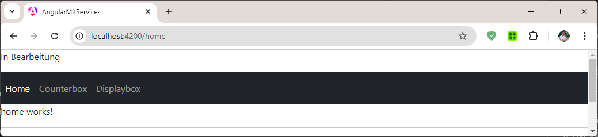
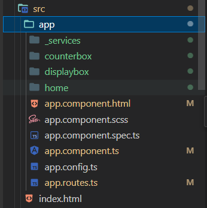
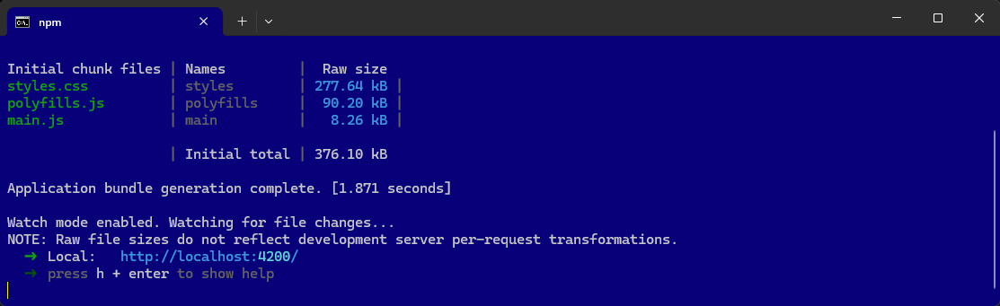

# AngularMitServices | Counter

In dieser Anleitung wird beschrieben, wie ein Angular-Projekt mit Bootstrap und einer Service-Unterstützung erstellt wird. 



## Voraussetzungen
- Angular CLI muss installiert sein (`npm install -g @angular/cli`).


# Anleitung

### Ein neues Angular-Projekt erstellen
Erstelle ein neues Angular-Projekt, wie in der vorherigen Anleitung beschrieben:

```terminal
ng new AngularMitServices
```

- Wähle `Sass (SCSS)` als Stylesheet-Format.
- Aktiviere SSR und SSG nicht, wenn gefragt (`n`).


Sass (SCSS) auswählen:

```` terminal
? Which stylesheet format would you like to use?
  CSS             [ https://developer.mozilla.org/docs/Web/CSS                     ]
❯ Sass (SCSS)     [ https://sass-lang.com/documentation/syntax#scss                ]
  Sass (Indented) [ https://sass-lang.com/documentation/syntax#the-indented-syntax ]
  Less            [ http://lesscss.org                                             ]
````

SSR und SSG NICHT aktivieren:

```` terminal
? Which stylesheet format would you like to use? Sass (SCSS) 
[ https://sass-lang.com/documentation/syntax#scss          ]
? Do you want to enable Server-Side Rendering (SSR) and Static Site Generation (SSG/Prerendering)? (y/N) N
````


Wechsle dann ins Projektverzeichnis:

```terminal
cd AngularMitServices
```

### Bootstrap hinzufügen
Füge Bootstrap dem Projekt hinzu:

```terminal
npm install bootstrap
```


Öffne das Projekt in Visual Studio Code:

```terminal
code .
```

Bearbeite die `angular.json`, um Bootstrap einzubinden:

```json
{
  ...
  "styles": [
    "src/styles.scss",
    "node_modules/bootstrap/dist/css/bootstrap.min.css"
  ],
  ...
}
```

----

### User-Komponenten erstellen
Für die Seite erstellen wir folgende Komponenten:

```terminal
ng generate component home
ng generate component counterbox
ng generate component displaybox
```

oder

```terminal
ng g c home
ng g c counterbox
ng g c displaybox
```

Die Komponenten dienen dazu, den Counter und aktuellen Wert des Counters anzuzeigen.



----

### Services erstellen 
Erstelle einen Service, der die Daten verwaltet:

```terminal
ng generate service _services/counter
```

Services wird später bearbeitet!

----


### Routes anpassen

Bearbeite die Datei `app.routes.ts` , um die Routen für die Benutzerverwaltung zu definieren:

```` typescript
import { Routes } from '@angular/router';

// EINTRAGEN
import { HomeComponent } from './home/home.component';
import { CounterboxComponent } from './counterbox/counterbox.component';
import { DisplayboxComponent } from './displaybox/displaybox.component';

//export const appRoutes: Routes = [
export const routes: Routes = [

  // EINTRAGEN
  { path: 'home', component: HomeComponent },
  { path: 'counterbox', component: CounterboxComponent },
  { path: 'displaybox', component: DisplayboxComponent },

  // STARTSEITE
  { path: '', redirectTo: 'home', pathMatch: 'full' },
  { path: '**', redirectTo: 'home' }, // Wildcard-Route für alle nicht gefundenen Pfade
];
````


### app.component aktualisieren

Bearbeite die Datei `app.component.html` :

```` html
<p>In Bearbeitung</p>

<router-outlet />
````

Im Url angegebene Component (wie `/counterbox/`) wird im router-outlet ausgegeben.

Die URLs, die im Routes realisiert worden sind:

```` html
http://localhost:4200/home/
http://localhost:4200/counterbox/
http://localhost:4200/displaybox/

http://localhost:4200/ ---> home
```` 
----


### Navigation

Bearbeite die Datei `app.component.html` und füge eine einfache Navigation hinzu, um auf die Services zugreifen zu können:

```` html
<p>In Bearbeitung</p>

<nav>
    <ul>
        <li><a routerLink="/home" routerLinkActive="active">Home</a></li>
        <li><a routerLink="/counterbox" routerLinkActive="active">Counterbox</a></li>
        <li><a routerLink="/displaybox" routerLinkActive="active">Displaybox</a></li>
    </ul>
</nav>

<router-outlet />
````

oder

```` html
<p>In Bearbeitung</p>

<nav class="navbar navbar-expand-lg navbar-dark bg-dark">
    <ul class="navbar-nav">
        <li class="nav-item">
            <a class="nav-link" routerLink="/home" routerLinkActive="active">Home</a>
        </li>
        <li class="nav-item">
            <a class="nav-link" routerLink="/counterbox" routerLinkActive="active">Counterbox</a>
        </li>
        <li class="nav-item">
            <a class="nav-link" routerLink="/displaybox" routerLinkActive="active">Displaybox</a>
        </li>

    </ul>
</nav>

<router-outlet />
````

Bearbeite die Datei `app.component.ts` und füge die Imports hinzu:

```` html
import { Component } from '@angular/core';
import { RouterOutlet } from '@angular/router';

// EINTRAGEN für Router!
import { RouterLink, RouterLinkActive } from '@angular/router'; 

@Component({
  selector: 'app-root',
  standalone: true,
  imports: [
    RouterOutlet,

    RouterLink,        // <-- EINTRAGEN für Router!
    RouterLinkActive,  // <-- EINTRAGEN für Router!

  ],
  templateUrl: './app.component.html',
  styleUrl: './app.component.scss'
})
export class AppComponent {
  title = 'AngularMitRouting';
}
````

----

## npm start | Ausführen der Anwendung

So wird nun der Angular-Entwicklungsserver (`ng serve`) verwendet, um die Anwendung zu starten.

```` terminal
npm start
````

oder

```` terminal
ng serve --open
````




So kann das gesamte Projekt mit nur einem Befehl (`npm start`) gebaut und auf einem Server bereitgestellt werden!


----

### Services bearbeiten | CounterService


Bearbeite die Datei `_services/counter.service.ts`, um den aktuellen Wert des Counters zu verwenden:

`_services/counter` vorher:

```` typescript
import { Injectable } from '@angular/core';

@Injectable({
  providedIn: 'root'
})
export class CounterService {

  constructor() { }
}
````

`_services/counter` nacher:

```` typescript
import { Injectable } from '@angular/core';

@Injectable({
  providedIn: 'root'
})
export class CounterService {

  constructor() { }

  // --- COUNTER ---- START

  public counter : number = 0; // <-- Instanzvariable

  plus(){
    // NUR über this !!!!
    this.counter++; // Greift auf die Instanzvariable zu
  }

  minus(){
    // NUR über this !!!!
    this.counter--; // Greift auf die Instanzvariable zu
  }

  // --- COUNTER ---- ENDE

}
````

----

### CounterBox implementieren + DI CounterService

CounterService importieren und über den Konstruktor an die DI übergeben:

Bearbeite die Datei `counterbox.component.ts`, um den Counter aus der Service-Klasse zu laden:

```` typescript
import { Component } from '@angular/core';

// 1 - EINTRAGEN
import { CounterService } from '../_services/counter.service';

@Component({
  selector: 'app-counterbox',
  standalone: true,
  imports: [],
  templateUrl: './counterbox.component.html',
  styleUrl: './counterbox.component.scss'
})
export class CounterboxComponent {

  // 2 - EINTRAGEN - DI
  // protected ermöglicht den Zugriff der Html-Seite auf die Service-Elemente
  constructor( protected counterService: CounterService ) {}

}
````

Bearbeite die Datei `counterbox.component.html`, um den Counter zu realisieren:

```` html
<p>counterbox works!</p>

<div class="counter d-flex align-items-center">
    <button class="btn btn-primary me-2" 
        (click)="this.counterService.minus()">-</button>
    <div class="mx-2">{{ this.counterService.counter }}</div>
    <button class="btn btn-primary ms-2" 
        (click)="this.counterService.plus()">+</button>
</div>
````

----


### DisplayBox implementieren + DI CounterService

CounterService importieren und über den Konstruktor an die DI übergeben:

Bearbeite die Datei `displaybox.component.ts`, um den Counter aus der Service-Klasse zu laden:

```` typescript
import { Component } from '@angular/core';

// 1 - EINTRAGEN
import { CounterService } from '../_services/counter.service';

@Component({
  selector: 'app-displaybox',
  standalone: true,
  imports: [],
  templateUrl: './displaybox.component.html',
  styleUrl: './displaybox.component.scss'
})
export class DisplayboxComponent {

  // 2 – DI
  // protected ermöglicht den Zugriff der Html-Seite auf die Service-Elemente
  constructor(protected counterService: CounterService){ }

}
````

Bearbeite die Datei `displaybox.component.html`, um den Counter-Werte auf der Seite anzuzeigen:

```` html
<p>displaybox works!</p>

<h2>Counter: {{ this.counterService.counter }}</h2>

````

----

### DisplayBox in die Startseite einbetten

Bearbeite die Datei `home.component.html`, um den displaybox-Komponent in die Startseite einzubeten:

```` html
<p>In Bearbeitung</p>

<nav class="navbar navbar-expand-lg navbar-dark bg-dark">
 ...
</nav>

<router-outlet />

<hr>

<app-displaybox></app-displaybox>

````

Ergebnis:


----

# Extras


## 1. npm start | Ausführen der Anwendung

So wird nun der Angular-Entwicklungsserver (`ng serve`) verwendet, um die Anwendung zu starten.

```` terminal
npm start
````

oder

```` terminal
ng serve --open
````

http://localhost:4200/


So kann das gesamte Projekt mit nur einem Befehl (`npm start`) gebaut und auf einem Server bereitgestellt werden!


## 2. Port überprüfen und Prozess beenden

Sie können prüfen, welcher Prozess Port 4200 verwendet und diesen gegebenenfalls beenden.

Verwenden Sie den folgenden Befehl in der Eingabeaufforderung (CMD), um den Port zu überprüfen:

```` terminal
netstat -ano | findstr :4200
````

Dies gibt eine Liste der Prozesse zurück, die Port 4200 verwenden. 
Notieren Sie sich die Prozess-ID (`PID`) des Prozesses.

Um den Prozess zu beenden, verwenden Sie den folgenden Befehl:

```` terminal
taskkill /PID <PID> /F
````

Ersetzen Sie <PID> durch die ID des Prozesses, den Sie beenden möchten.

Probieren Sie diese Lösungsschritte aus und starten Sie anschließend den HTTP-Server erneut.

## Markdown-Datei (.md)


