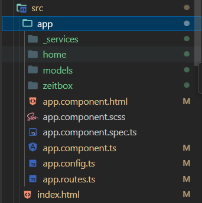
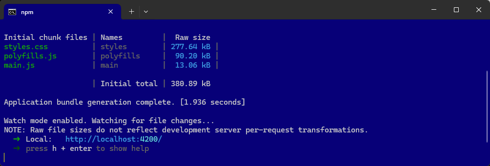

# AngularMitServices | Arbeitszeiten

Angular, Bootstrap, Models, Services, PWA

In dieser Anleitung wird beschrieben, wie ein Angular-Projekt mit Bootstrap und einer Service-Unterstützung erstellt wird. 


## Voraussetzungen
- Angular CLI muss installiert sein (`npm install -g @angular/cli`).


# Anleitung

### Ein neues Angular-Projekt erstellen
Erstelle ein neues Angular-Projekt, wie in der vorherigen Anleitung beschrieben:

```terminal
ng new AngularMitServices
```

- Wähle `Sass (SCSS)` als Stylesheet-Format.
- Aktiviere SSR und SSG nicht, wenn gefragt (`n`).


Sass (SCSS) auswählen:

```` terminal
? Which stylesheet format would you like to use?
  CSS             [ https://developer.mozilla.org/docs/Web/CSS                     ]
❯ Sass (SCSS)     [ https://sass-lang.com/documentation/syntax#scss                ]
  Sass (Indented) [ https://sass-lang.com/documentation/syntax#the-indented-syntax ]
  Less            [ http://lesscss.org                                             ]
````

SSR und SSG NICHT aktivieren:

```` terminal
? Which stylesheet format would you like to use? Sass (SCSS) 
[ https://sass-lang.com/documentation/syntax#scss          ]
? Do you want to enable Server-Side Rendering (SSR) and Static Site Generation (SSG/Prerendering)? (y/N) N
````


Wechsle dann ins Projektverzeichnis:

```terminal
cd AngularMitServices
```

### Bootstrap hinzufügen
Füge Bootstrap dem Projekt hinzu:

```terminal
npm install bootstrap
```


Öffne das Projekt in Visual Studio Code:

```terminal
code .
```

Bearbeite die `angular.json`, um Bootstrap einzubinden:

```json
{
  ...
  "styles": [
    "src/styles.scss",
    "node_modules/bootstrap/dist/css/bootstrap.min.css"
  ],
  ...
}
```

----

### PWA-Unterstützung hinzufügen

Füge PWA-Unterstützung dem Projekt hinzu:

```terminal
ng add @angular/pwa
```
y

Dieser Befehl fügt alle notwendigen Dateien und Konfigurationen für PWA hinzu:
 - ngsw-config.json: Konfiguration für den Service Worker.
 - manifest.webmanifest: Ermöglicht das Hinzufügen der App zum Startbildschirm.


----

### User-Komponenten erstellen
Für die Seite erstellen wir folgende Komponenten:

```terminal
ng generate component home
ng generate component zeitbox
```

oder

```terminal
ng g c home
ng g c zeitbox
```

Die Komponenten dienen dazu, die Arbeitszeiten zu verwalten.




----

### Services erstellen 
Erstelle einen Service, der die Daten verwaltet:

```terminal
ng generate service _services/arbeitszeiten
```

Services wird später bearbeitet!

----


### Routes anpassen

Bearbeite die Datei `app.routes.ts` , um die Routen für die Benutzerverwaltung zu definieren:

```` typescript
import { Routes } from '@angular/router';

// EINTRAGEN
import { HomeComponent } from './home/home.component';
import { ZeitboxComponent } from './zeitbox/zeitbox.component';

//export const appRoutes: Routes = [
export const routes: Routes = [

  // EINTRAGEN
  { path: 'home', component: HomeComponent },
  { path: 'zeitbox', component: ZeitboxComponent },
  
  // STARTSEITE
  { path: '', redirectTo: 'home', pathMatch: 'full' },
  { path: '**', redirectTo: 'home' }, // Wildcard-Route für alle nicht gefundenen Pfade
];
````

----

### app.component aktualisieren

Bearbeite die Datei `app.component.html` :

```` html
<p>In Bearbeitung</p>

<router-outlet />
````

Im Url angegebene Component (wie `/zeitbox/`) wird im router-outlet ausgegeben.

Die URLs, die im Routes realisiert worden sind:

```` html
http://localhost:4200/home/
http://localhost:4200/zeitbox/

http://localhost:4200/ ---> home
```` 

----


### Navigation

Bearbeite die Datei `app.component.html` und füge eine einfache Navigation hinzu, um auf die Services zugreifen zu können:

```` html
<p>In Bearbeitung</p>

<nav class="navbar navbar-expand-lg navbar-dark bg-dark">
    <ul class="navbar-nav">
        <li class="nav-item">
            <a class="nav-link" routerLink="/home" routerLinkActive="active">Home</a>
        </li>
        <li class="nav-item">
            <a class="nav-link" routerLink="/zeitbox" routerLinkActive="active">Zeitbox</a>
        </li>

    </ul>
</nav>

<router-outlet />
````

Bearbeite die Datei `app.component.ts` und füge die Imports hinzu:

```` typescript
import { Component } from '@angular/core';
import { RouterOutlet } from '@angular/router';

// EINTRAGEN für Router!
import { RouterLink, RouterLinkActive } from '@angular/router'; 

@Component({
  selector: 'app-root',
  standalone: true,
  imports: [
    RouterOutlet,

    RouterLink,        // <-- EINTRAGEN für Router!
    RouterLinkActive,  // <-- EINTRAGEN für Router!

  ],
  templateUrl: './app.component.html',
  styleUrl: './app.component.scss'
})
export class AppComponent {
  title = 'AngularMitRouting';
}
````

----


## npm start | Ausführen der Anwendung

So wird nun der Angular-Entwicklungsserver (`ng serve`) verwendet, um die Anwendung zu starten.

```` terminal
npm start
````

oder

```` terminal
ng serve --open
````





So kann das gesamte Projekt mit nur einem Befehl (`npm start`) gebaut und auf einem Server bereitgestellt werden!

----

### User-Modell erstellen

Erstelle ein Modell für die Benutzerverwaltung:

```terminal
ng generate class models/arbeitszeit
```

Bearbeite die Datei `models/arbeitszeit.ts` wie folgt:

Vorsicht! Ohne Default-Werte würden die Variablen `undefined` sein.

```typescript
export class Arbeitszeit {
    id: number;
    datum: string;  // Das Datum sollte im Format TT.MM.JJJJ sein
    startzeit: string;  // Startzeit als HH:MM
    endzeit: string;    // Endzeit als HH:MM

    constructor(id: number, datum: string, startzeit: string, endzeit: string) {
        this.id = id;
        this.datum = datum;
        this.startzeit = startzeit;
        this.endzeit = endzeit;
    }
}
````

----

### Services bearbeiten | ArbeitszeitenService


Bearbeite die Datei `_services/arbeitszeiten.service.ts`, um Zeiteinträge zu verwalten:

`_services/arbeitszeiten` vorher:

```` typescript
import { Injectable } from '@angular/core';

@Injectable({
  providedIn: 'root'
})
export class ArbeitszeitenService {

  constructor() { }
}
````

`_services/arbeitszeiten` nacher:

```` typescript
import { Injectable } from '@angular/core';

// EINTRAGEN
import { Arbeitszeit } from '../models/arbeitszeit';

@Injectable({
  providedIn: 'root'
})
export class ArbeitszeitenService {

  constructor() { 
    this.loadArbeitszeiten();  // Lade Arbeitszeiten beim Start
  }


 // Neue Methode zum Speichern der Arbeitszeiten im LocalStorage
 saveArbeitszeiten(): void {
  localStorage.setItem('arbeitszeiten', JSON.stringify(this.arbeitszeiten));
}

// Neue Methode zum Laden der Arbeitszeiten aus dem LocalStorage
loadArbeitszeiten(): void {
  const storedArbeitszeiten = localStorage.getItem('arbeitszeiten');
  if (storedArbeitszeiten) {
    this.arbeitszeiten = JSON.parse(storedArbeitszeiten);
  }
}


  // EINTRAGEN
  arbeitszeiten: Arbeitszeit[] = [];

  // Funktion zum Hinzufügen einer neuen Arbeitszeit
  addArbeitszeit(arbeitszeit: Arbeitszeit): void {
    this.arbeitszeiten.push(arbeitszeit);
    this.saveArbeitszeiten();  // Speichere nach Hinzufügen
  }

  // Funktion zum Entfernen einer Arbeitszeit per Id
  removeArbeitszeit(id: number): void {
    this.arbeitszeiten = this.arbeitszeiten.filter(zeit => zeit.id !== id);
    this.saveArbeitszeiten();  // Speichere nach Entfernen
  }

  // Funktion zum Aktualisieren einer bestehenden Arbeitszeit
  updateArbeitszeit(updatedArbeitszeit: Arbeitszeit): void {
    const index = this.arbeitszeiten.findIndex(zeit => zeit.id === updatedArbeitszeit.id);
    if (index !== -1) {
      this.arbeitszeiten[index] = updatedArbeitszeit;
      this.saveArbeitszeiten();  // Speichere nach Aktualisieren
    }
  }

  // Funktion zum Abrufen aller Arbeitszeiten
  getArbeitszeiten(): Arbeitszeit[] {
    return this.arbeitszeiten;
  }

}

````

----

### Zeitbox-Komponent (.ts und .html) bearbeiten


Bearbeite die Datei `zeitbox.component.ts`:

```` typescript
import { Component } from '@angular/core';

// EINTRAGEN
import { ArbeitszeitenService } from '../_services/arbeitszeiten.service';
import { Arbeitszeit } from '../models/arbeitszeit';

// EINTRAGEN für Formular-Elemente ngSubmit und ngModel
import { NgForm, FormsModule } from '@angular/forms';  // Für ngSubmit und ngModel

// EINTRAGEN für ngFor
import { CommonModule } from '@angular/common';  // Für ngFor

@Component({
  selector: 'app-zeitbox',
  standalone: true,
  imports: [
    FormsModule, // EINTRAGEN für Formular-Elemente ngSubmit und ngModel
    CommonModule, // EINTRAGEN für ngFor
  ],  
  templateUrl: './zeitbox.component.html',
  styleUrl: './zeitbox.component.scss'
})
export class ZeitboxComponent {

  // Formular Objekt
  arbeitszeit: Arbeitszeit = new Arbeitszeit(0, '', '', '');

  // List-Objekt
  arbeitszeiten: Arbeitszeit[] = [];

  // DI für ArbeitszeitenService
  constructor(private arbeitszeitenService: ArbeitszeitenService) {}

  ngOnInit(): void {
    this.arbeitszeiten = this.arbeitszeitenService.getArbeitszeiten();
  }

  onSubmit(): void {
    if (this.arbeitszeit.datum && this.arbeitszeit.startzeit && this.arbeitszeit.endzeit) {
      this.arbeitszeit.id = this.arbeitszeiten.length + 1;  // Generiere eine einfache Id
      this.arbeitszeitenService.addArbeitszeit(this.arbeitszeit);

      this.arbeitszeiten = this.arbeitszeitenService.getArbeitszeiten();  // Aktualisiere die Liste

      this.arbeitszeit = new Arbeitszeit(0, '', '', '');  // Formular leeren
    }
  }

  removeArbeitszeit(id: number): void {
    this.arbeitszeitenService.removeArbeitszeit(id);
    this.arbeitszeiten = this.arbeitszeitenService.getArbeitszeiten();  // Liste aktualisieren
  }

}

````
 
Bearbeite die Datei `zeitbox.component.html`:

```` html
<p>zeitbox works!</p>

<div class="container">

    <h2>Arbeitszeit hinzufügen</h2>

    <form #arbeitszeitForm="ngForm" (ngSubmit)="onSubmit()">

      <div class="mb-3">
        <label for="datum" class="form-label">Datum</label>
        <input type="date" id="datum" name="datum" [(ngModel)]="arbeitszeit.datum" class="form-control" required>
      </div>
  
      <div class="mb-3">
        <label for="startzeit" class="form-label">Startzeit</label>
        <input type="time" id="startzeit" name="startzeit" [(ngModel)]="arbeitszeit.startzeit" class="form-control" required>
      </div>
  
      <div class="mb-3">
        <label for="endzeit" class="form-label">Endzeit</label>
        <input type="time" id="endzeit" name="endzeit" [(ngModel)]="arbeitszeit.endzeit" class="form-control" required>
      </div>
  
      <button type="submit" class="btn btn-primary">Speichern</button>
      
    </form>
  
    <hr />

    <h3 class="mt-4">Liste der Arbeitszeiten</h3>

    <ul class="list-group">
      <li *ngFor="let zeit of arbeitszeiten" class="list-group-item">
        {{ zeit.datum }}: {{ zeit.startzeit }} - {{ zeit.endzeit }}
        <button class="btn btn-danger btn-sm float-end" (click)="removeArbeitszeit(zeit.id)">Löschen</button>
      </li>
    </ul>

  </div>
````


----

# Extras


## 1. npm start | Ausführen der Anwendung

So wird nun der Angular-Entwicklungsserver (`ng serve`) verwendet, um die Anwendung zu starten.

```` terminal
npm start
````

oder

```` terminal
ng serve --open
````

http://localhost:4200/


So kann das gesamte Projekt mit nur einem Befehl (`npm start`) gebaut und auf einem Server bereitgestellt werden!


## 2. Port überprüfen und Prozess beenden

Sie können prüfen, welcher Prozess Port 4200 verwendet und diesen gegebenenfalls beenden.

Verwenden Sie den folgenden Befehl in der Eingabeaufforderung (CMD), um den Port zu überprüfen:

```` terminal
netstat -ano | findstr :4200
````

Dies gibt eine Liste der Prozesse zurück, die Port 4200 verwenden. 
Notieren Sie sich die Prozess-ID (`PID`) des Prozesses.

Um den Prozess zu beenden, verwenden Sie den folgenden Befehl:

```` terminal
taskkill /PID <PID> /F
````

Ersetzen Sie <PID> durch die ID des Prozesses, den Sie beenden möchten.

Probieren Sie diese Lösungsschritte aus und starten Sie anschließend den HTTP-Server erneut.

----

## Markdown-Datei (.md)


