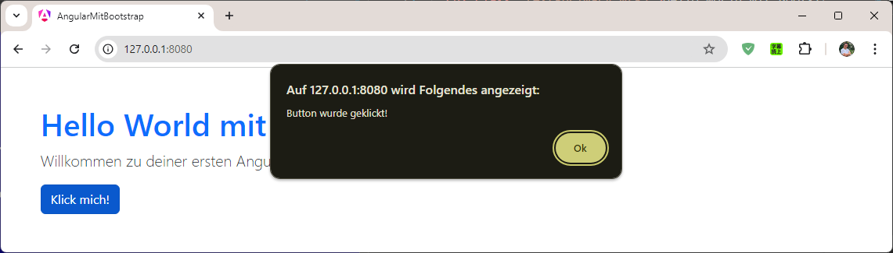
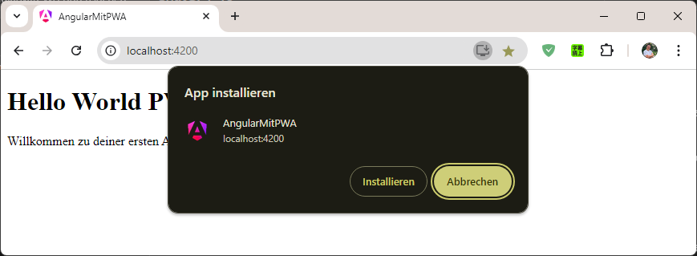
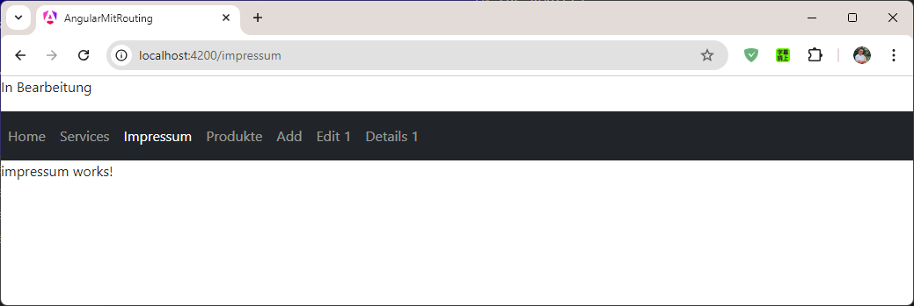
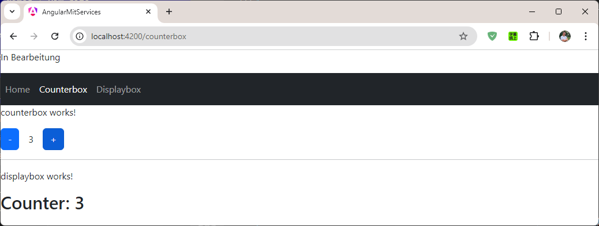
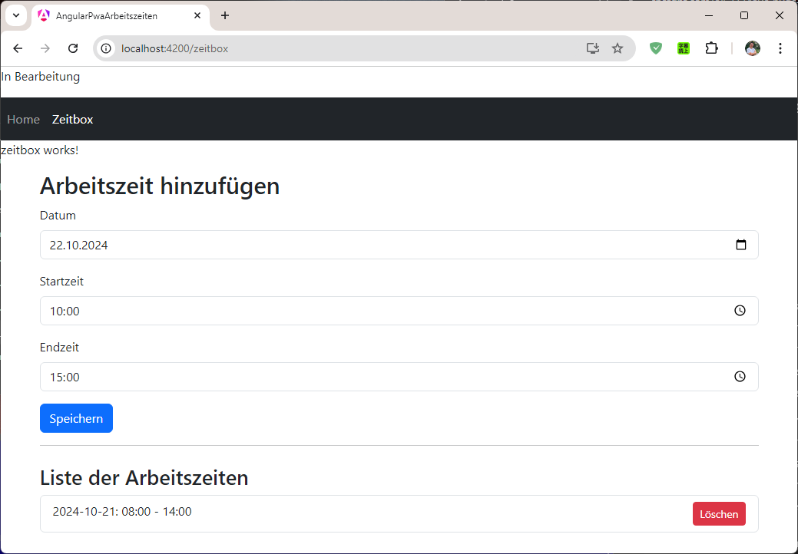

# Angular Beispiele in VS Code

Die Anwendungen zeigen, wie man Angular mit verschiedenen Technologien in einem Webprojekt verwendet wird.

## AngularMitBootstrap



Ein einfaches Angular-Projekt, das die Integration von Bootstrap zeigt. Es demonstriert, wie Bootstrap-Styling zu Angular-Anwendungen hinzugefügt werden kann, um das Design und die Funktionalität mit vordefinierten UI-Komponenten zu verbessern.

[AngularMitBootstrap Anleitung](./AngularMitBootstrap/readme.md)


## AngularMitPWA



Dieses Projekt erweitert ein Angular-Projekt um Unterstützung für Progressive Web Apps (PWA). Es zeigt, wie man PWA-Funktionalitäten wie Offline-Fähigkeit und Installation auf mobilen Geräten hinzufügt, indem man den Angular-PWA-Support integriert.

[AngularMitPWA Anleitung](./AngularMitPWA/readme.md)


## AngularMitRouting



Ein Angular-Projekt, das zeigt, wie Routing in einer Angular-Anwendung eingerichtet wird. Es demonstriert die Erstellung von Routen für eine Single-Page-Anwendung (SPA), sodass verschiedene Komponenten basierend auf der URL geladen werden können.

[AngularMitRouting Anleitung](./AngularMitRouting/readme.md)


## AngularMitServices | Counter



Dieses Projekt integriert Services in eine Angular-Anwendung. Es zeigt, wie Services erstellt und genutzt werden, um Daten- und Logikschichten von der Präsentationsschicht getrennt zu handhaben und die Wiederverwendbarkeit von Code zu erhöhen.

[AngularMitServices Anleitung](./AngularMitServices/readme.md)


## AngularPwaArbeitszeiten



Eine Angular-Anwendung, die sowohl PWA-Funktionen als auch Services verwendet, um Arbeitszeiten zu verwalten. Sie erlaubt das Erfassen, Anzeigen und Speichern von Arbeitszeiten mit Offline-Funktionalität, indem sie sowohl lokale Speicher als auch PWA-Technologien nutzt.

[AngularPwaArbeitszeiten Anleitung](./AngularPwaArbeitszeiten/readme.md)


## AngularMitRestAPI

In Bearbeitung


----


## Git Konto wechseln und commiten

```` 
git init

git add .
git commit -m "Initial commit"

git branch -M main 

git remote add origin https://github.com/ugurat/Angular-Beispiele-VS-Code.git

git push -u origin main
````

Falls Fehler:

````
PASSWORT LÖSCHEN und ERNEUT ANMELDEN

Gehe zu "Windows-Anmeldeinformationen": 
Unter Windows-Anmeldeinformationen "gespeicherte Zugangsdaten für Webseiten und Anwendungen" finden.

Suche nach gespeicherten GitHub-Einträgen: 
git:https://github.com oder Ähnliches.

Eintrag löschen und erneut versuchen: 

git push -u origin main
````
  
Aktualisiert

````
git add .
git commit -m "aktualisiert"
git push -u origin main
````

Überschreiben

````

git init

git add .
git commit -m "Initial commit"

git branch -M main 

git remote add origin https://github.com/ugurat/Angular-Beispiele-VS-Code.git

git push -u origin main --force

````

Mit dem Parameter `--force` wird Git-Repo überschrieben. 

----


## Entwickler
- **Name**: Ugur CIGDEM
- **E-Mail**: [ugurat@gmail.com](mailto:ugurat@gmail.com)

---

## Markdown-Datei (.md)

---

